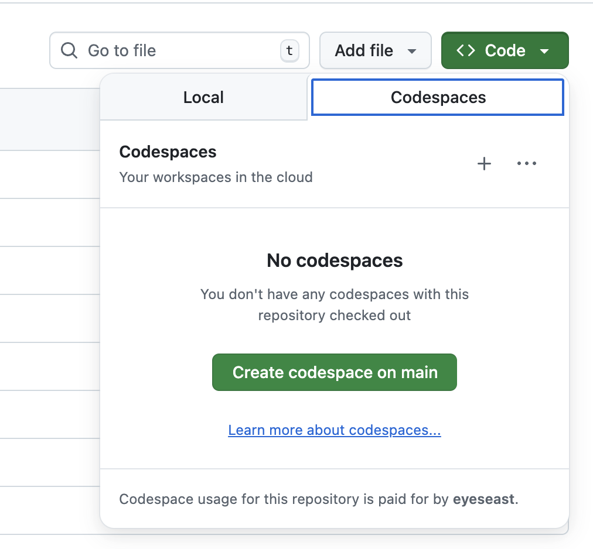

# MuckRock LLM starter kit

## Get started on Github



Creating a codespace will open a hosted version of VS Code running a dev container for this repository. It will install Python, `llm` and several plugins, including `llm-documentcloud`.

## Working with installed libraries

Everything is installed locally with `uv`. To run scripts such as `llm`, prefix it with `uv`, like so:

```sh
uv run llm --help
```

If you'd like to install tools globally, use `uv tool` inside the running container:

```sh
uv tool install llm # now it's global
```

If you break it, throw it away and try again.
